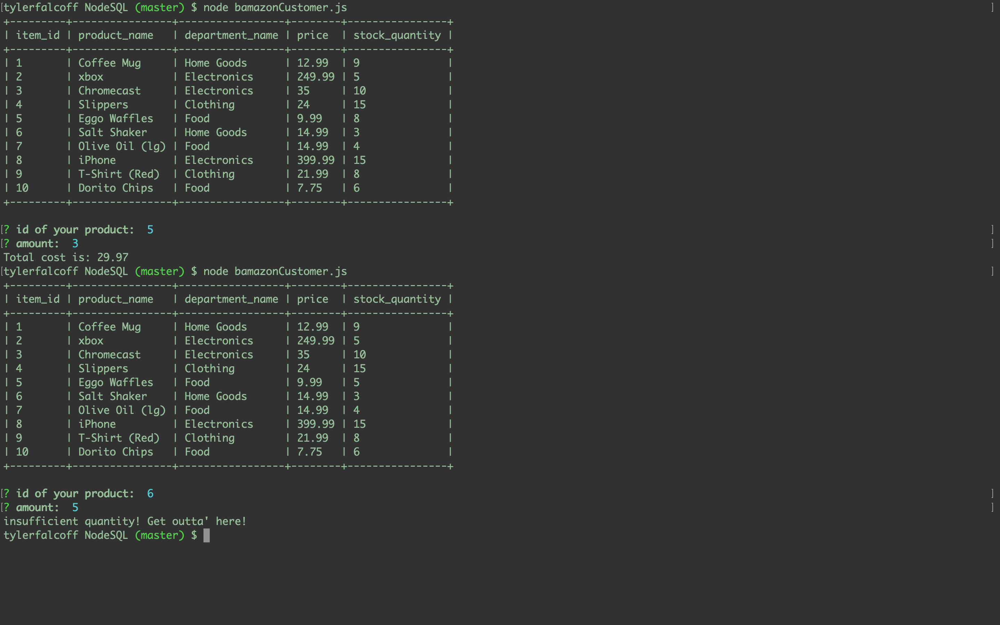

# bamazon (Node.js and SQL)

### Customer Experience 

* Prompts for item id based off of prettified table
* Prompts for quantity of item
* Updates table quantity if able and sends message of total price
* Sends message of insufficient quantity if else

